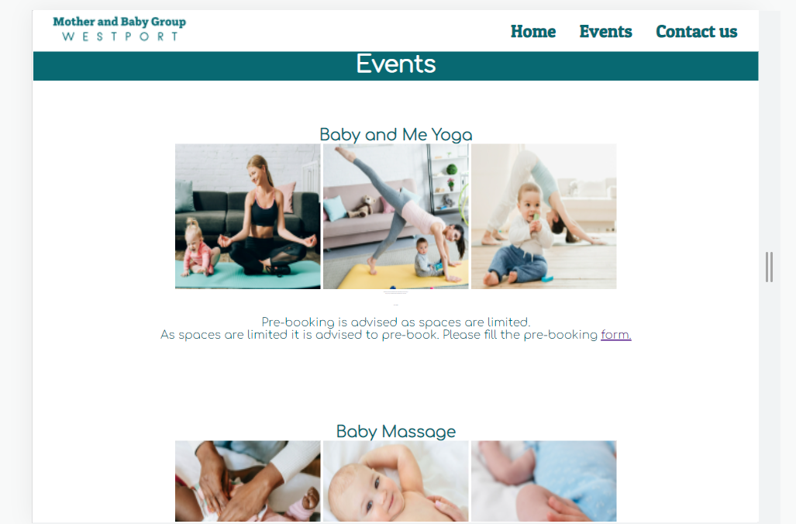
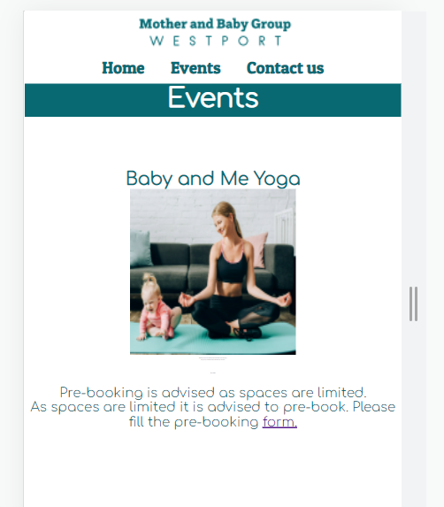
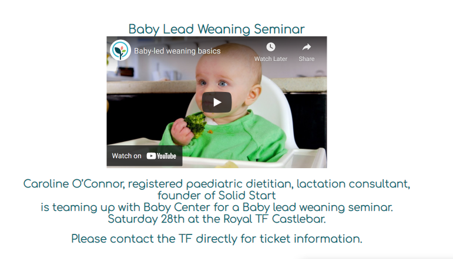
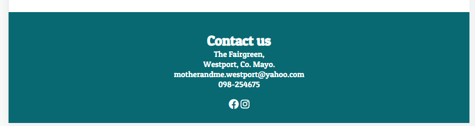
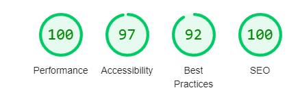
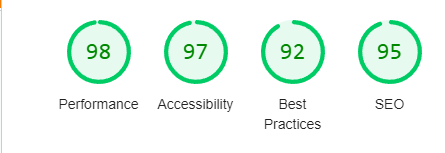

# **_Westport's Mother and Baby group - Project Portfolio 1 - HTML & CSS_**
They say it takes a village to raise a child, well this website aims to allow new parents to reach out to their community and build that support system. Not only will it outline Westport's Mother and baby group meetups and schedules, but also have a section for other events organised by the mother and baby grounp and within the greater Westport community.

You can view the live site here - ,a href="https://lauramayock.github.io/motherandbaby/" target="_blank"> Westport Mother and baby. </a>

                                                            Image of sight on all screens

#Content

* [Objectives](<#objective>)
* [User Experience](<user-experience-ux>)
    * [Target Audience](<#target-audience>)
    * [First time user](<user-stories>)
    * [Retur user](<user-stories>)
    * [Site Aims](<#site-aims>)
    * [Design Wireframes](<#design-wireframes>)
    * [Site Structure](<#site-structure>)
    * [Design Choices](<#design-choices>)
    * [Imagery](<#Imagery>)
    * [Logo](<#logo>)
    * [Colour Scheme](<#colour-scheme>)
    * [Typography](<#typography>)
* [Features](<#features>)
    * [Navigation Menu](<#navigation-menu>)
    * [Home Page](<#home-page>)
    * [Events page](<#events-page>)
    * [Pre-booking](<#pre-booking-page>)
    * [Contact us page](<#contact-us-page>)
    * [Footer](<#footer>)
* [Future Features](<#future-features>)
* [Technologies Used](<#technologies-used>)
* [Testing](<#testing>)
    * [Code Validation](<#code-validation>)
    * [Lighthouse Testing](<#lighthouse-testing>)
    * [Accessibility Testing](<#accessibility-testing>)
    * [Manual Testing](<#manual-testing>)
    * [Bugs Fixed](<#bugs-fixed>)
* [Deployment](<#deployment>)
* [Credits](<#credits>)
* [Acknowledgements](<#acknowledgements>)

# Objective

The aim is to create a user-friendly website that provides helpful information to a specific user/audience. The reader has easy access to evident and relayed information on the topic of interest. 

[Back to top](#contents)

# User Experience: (UX)

## Target Audience
* Parents, Guardians and carers of babies and pre-school children looking to connect with others are their local community.
* Parents, Guardians and carers of children are looking for information on upcoming events geared towards families.

## First time user:
As a first time visitor, I want a clear understanding of the purpose of the page and to navigate to the areas most important to me. I will be hoping to see local meet up schedules and a way to contact organisers if I have any other queries. It will be a pleasant surprise to have additional local resource information and the option to be added to a Whats app group.

## Return user:
As a returning user, I will be taking advantage of the events page for my little ones, e.g. mother and baby yoga classes, baby massage and upcoming family events, and pre-book my place.

## Site Aims
 * To provide the user with all the information on the weekly meetups. 
 * To offer information on upcomming events geared young familys both within the Mother and baby group and within the grater Westport community. 
 * To create a welcoming and intuite website that provide a great online presence
  of the Mother and baby group. I also hope to try and make the users feel welcome with the imagery and tones used in the design as well as the testimonial section. I also aimed to give them as much value as HTML and CSS would allow with the added welcome of local events not linked to the mother and baby group pre-booking form and the ability to be added to a messaging group. Other features may be added in the future, such as direct booking for future events, a blog, a list of local community resources and a live chat area where moms can get to know each other on the site. 

## Design Wireframes
The innitial goals and scope of the website were worked on and planned using figma. The sturctue and scope of the website differs from the initial planning as i deemed it important to initially approach the project considering all possible feature that would be benificial for both the customer and the user. This provide a good basis for a minimum viable product as well as future add ons.

<a href="https://www.figma.com/file/ZrhdkArvufV5uAUs5XSpKw/Westport-Mother-and-baby-group?node-id=0%3A1" target="_blank">Figma link</a>

Wireframes were created using Balsamiq:

 Figma wireFrames

%20(Alternate%20755v).png)
%20(Alternate%20322h).png)

## Site Stucture

The website has four pages, with three accessible by the navigation bar at the top of the page. The Navigation bar consists of a Home tab(index.html), an Events tab(events.html) and a contact us tab(contact-us.html). The logo on the left-hand side of the navigation bar is also a link to the home page. The fourth page is accessible using the two form links on the events page. These bring you to a pre-booking from(pre-booking-form.html)  

## Design Choices

I tried to keep the design simple and keep the users in mind, giving them as much value as possible within the remit given. I think this approach will make the user feel already part of the community and hopefully alleviate any anxiety they may think about reaching out.

### Imagery

I found inspiration for my landing page from a fellow student's recent project submission.[Slack user name @Ivaylo Ivanov](https://daooobg.github.io/yogaClubProject) I loved the movement used in her hero element and looked to recreate it myself. I spent a great deal of time choosing the right hero image as I feel it sets the tone of the page and connects with the user.

I have outlined some of my considerations in choosing the correct hero element below:

* A video which is in tune with Mother and baby groups ethos.
* Something engaging but not distracting.
* No sharp, sudden movements.
* No apparent end and beginning.
* Something that works well on most if not all screen sizes.
 
 After much searching consideration, I was happy to preseed with the below choice as I feel it ticked all the boxes.  
 [video](assets/images/pexels-max-vakhtbovych-7394158.mp4)

The rest of the images on the website were purposely chosen to have the same natural tones as the hero image.
 
### Logo

After choosing the hero image, I then decided to design the Logo. Using the website Looka.com I tried to create something simple and elegant. 

[Origional logo design](assets/images/Mother%20and%20baby%20Logo.png)

Although I was initially thrilled with my design, I soon realised that the shape caused it to intrude into the hero image or create too much white space if placed on the navigation bar. In the end, I decided to simplify it and go with the logo presently used on sight.

### Colour scheme

My final choice of colours was chosen to fit in with the logo. A selection of Teal Green, and white. As the green was an intense colour, I knew they were a great choice of colour for contrasting, ensuring the eligibility of text and sticking with the theme of simplicity.

### Typography

I chose two fonts from the google font gallery. Comfortaa for the main text and Patua One for the information in the footer and the font on the contactus form. I did try a few options to highlight the quote below the hero video but decided against it as it was too jarring. I chose Arial as the font family to fall back on for Comfortaa as it would still fit in with the feel of the page. And the font Georgia as a fallback for Patua One.

[Back to top](<#content>)

#Features

## Navigation

* The navigation menu is positioned at the top of each page and gives the user easy access to the main areas of the website.
* The logo, which is also prominent on each page, gives an easy link back to the main page.
* The navigational link to the Pre-booking form is purposely placed within the advertisements, which are solely related to the event organised by the mother and baby group.
* This is to ensure minimum confusion for the user of the site.
* To ensure eligibility and easy use, the navigation bar converts from a row of navigation buttons at the top of the page to a row nestled beneath the logo on smaller screens.

* Each navigation link has a hover element as a visual add for the user. 

## Home Page

* As it is the landing page, it needed to appeal to the eye and striking. I wanted it to be memorable and unique but in keeping with the tone of the page. As the users lifesytles are busy, it is vital that the user immediately know they are on the correct website at a glance.
* For the larger screens, the hero video is falling a bit below the screen; this intuitively nudges the user to scroll down. On the smaller screens, you can see the opening heading which, as well as the hero video, is purposely chosen to connect with the user. 

* The main text area gives a quick overview of what to expect at each meeting. It provides critical information to alleviate user concerns by pointing out who the group facilitates and the amenities available to them and their child. 

* The Weekly meet up section gives a day, time and google link to the location of each of the meetups. Again the simple prominent design was purposely done for a user on the go. 

* The Testimonials section is also a key element in encouraging anxious new parents that the Westport mother and baby group is perfect for them. It helps lay the foundation of trust and kinship with the user by providing testimonials from users to relate to.

* Each element on this page has the first time user, the new parent eager to connect with their local community, and the returning user looking to find the information required quickly.

## Events Page

* The events pages provide up to date information on events organised by the Mother and baby ground and the community. This gives parents and carers a one-stop destination to find events, courses and family fun in their area. Ensuring return users to the website and a continued connection with families that have moved on from baby/toddler-aged children. 

* There are visuals for the user via photos of the events and a video with controls to give the user full control of its workings.

* The events section also links a pre-booking from within the website (pre-booking-form.html). The user can pre-book their chosen event, and the organisers can gauge popularity in the event and plan accordingly.

* I have purposely chosen to leave the link to the prebooking form blue and underlined; this is for easy recognition.

## Pre-Booking Page

* The pre-booking page gives the user added value as they can book their place in upcoming events. This also ensures return users to the website. 

* The form is quick to fill in and ensures that the required information is filled out in the correct fields. 

## Contact Us Page

* This page is easily accessible from both the Navigation bar and the link in the footer.

* This page holds a simple form to send queries to the organisers and a google map embedded with the office address and contact information in the footer.

* The form ensures that all required boxes are filled correctly before submitting.

## Footer

* The Footer as well as the Navigation bar is uniform throughout the website giving consistancy and ease for the user.

* It also has a link for users' ease that connects them us the Contact us pages(contact-us.html), which provides an opportunity to send a message to the organisers via messaging form.

* It also has links to the Mother and baby groups social media.

* Each social media link opens to a new tab.

[Back to top](<#content>)

# Future Features

* It would be very beneficial to upgrade the pre-booking page to a booking page. This would be beneficial for bothering the user and the customer.

* A resources section with access to local resources such as a list of local doctors, healthcare professions, and local amenities. This would be a great added benefit for first-time users and ensure returning users.

* A blog section would help keep users up to date with local news and keep users engaged.

* An online form would be such a benefit for users to connect with others in the area.

# Technologies used

* HTML5 - Provides the sturcture and content for the website.
* CSS3 - Provides the styling for the website.
* [I love img](https://www.iloveimg.com/) to comress and crop images.
* [Onlin video converter](https://video-converter.com/) to convert video to a MP4.
* gitpod - Used to develop website.
* GitBash - Used to push repository to Github.
* Github - Used host and deploy website.

[Back to top](<#content>)

# Testing

## Code Validation

The Westport Mother and baby website has been validated using W3C HTML Validator and W3C CSS Validator. There were minor error taht were corrected immediately. Larger errors are documented below in [#bugs-fixed](<#bugs-fixed>)

## Lighthouse Testing

The website was also put through Lighthouse testing via Chrome Devtools which tests a site under 4 different headings; Performance, Accessibility, Best Practices and SEO and it tests it under mobile and desktop criteria.

# Accessibility Testing

[Accesibe website](https://accessibe.com/) - As well as the accessibility test available on lighthouse i also ran a test using Accesibe.

##Manual Testing

In addition to the automated process above, manual testing was carried out on the site as well.

* Naviagtion Menu
    * Verified that all the links link to the appropriate page with no broken links on all pages.
    * Verified that the logo when clicked links back to the Home Page.
    * Verified that the logo image has an alt text.
    * Verified that the hover effects are consistent on all links.
    * Verified that the navigation bar is full responsive.

* Home Page
    * Verified that the Hero image is not pixelated and is fully responsive.
    * Verified that all images on the home page are optimised and have alt functions.
    * Verified that links to google maps in the meet up section are working.

* Events Page
    * Verified that all the images are optimised and have alt texts. 
    * Verified that all the elements are fully responsive.
    * Verified that the video is fully responisve.

* Pre-Booking page
    * Verified that contact form cannot be submitted without the required information (First Name, Last Name and Email Address)
    * Verified that once the information is submitted information is depositited into a dumpfile.
    * Verified that the page is responsive.

* Contact us page
    * Verified that contact form cannot be submitted without the required information (First Name, Last Name and Email Address)
    * Verified that the submit button send information to a dumpfile.
    * Verified that the mailto function works correctly on the email link.
    * Verified that the page is responsive responsive.

* Footer
    * Verified that the social media links are all linked properly to the releveant social media home pages.
    * Verified that all the social media links open in a new tab.

* Browser Testing

    * Love Light Photography has been manually tested in Google Chrome, Microsoft Edge, Mozilla Firefox and Safari on both desktop and mobile.
    * Verified that all images worked correctly
    * Verified that design and structure was consistent across all browsers.
    * Verfied responsiveness across all browsers.

<h2>Languages used

<H2>Testing
<h3>Main hero element.

I tested my idea of using a video for my hero element by creating a mock-up in Gitpod. As it was one of the main focuses of the landing page I wanted it to not distract from the other important elements on the page. 
I will also:
<ul>
<li>Ask for advice and guidance from my mentor.
<li>Post on a Slack peer review channel to get feedback from a broader user base.

My original positioning of the hero video meant that you needed to scroll down to see the image in full. I corrected this by placing the scroll bar on top of the image.
<li> Slide show of recent event.
<li> Hover effect for navigation links.
<li> Input form
<li> video showing recent event.
<li> Social media buttons
<li>

<h2>Technologies used</h2>

<h2>Languages used

<H2>Testing
<h3>Main hero element.

I tested my idea of using a video for my hero element by creating a mock-up in Gitpod. As it was one of the main focuses of the landing page I wanted it to not distract from the other important elements on the page. 
I will also:
<ul>
<li>Ask for advice and guidance from my mentor.
<li>Post on a Slack peer review channel to get feedback from a broader user base.

My original positioning of the hero video meant that you needed to scroll down to see the image in full. I corrected this by placing the scroll bar on top of the image.